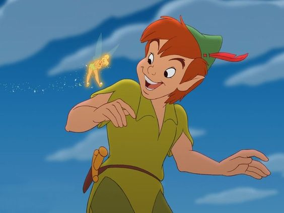

# C108118215_1
# This is an H1
## This is an H2
### This is an H3
#### This is an H4
##### This is an H5
###### This is an H6
>高雄市
>>三民區
>>
>>楠梓區

🧑‍🚀
:basecamp:

`就是我`

[youtube](https://www.youtube.com/)
[](https://pbs.twimg.com/profile_images/1215453415477673984/vTX_gSqc_400x400.jpg "AWESOME")



- [ ] to do list
- [X] none

*斜體*
**粗體**
***粗斜體***
~~刪除線~~

* 嗨1
* 嗨2
* 嗨3
1. T1
2. T2
3. T3
```Python
S = "Python syntax highlight"
print s
```
```javascript
var s = "javascript syntax highlight"
alert (s);
```
| Tables          | Are                |  Cool            |
| :-------------  | :----------------: |  --------------: |
|  clo 3 is       |   right-alighed    |   $16000         |
|  clo 2 is       |     centered       |   $12            |
|  zebra stripes  |     are neat       |   $1             |
   
| Markdown        | Less               |      Pretty      |
| :-------------- | :---------------   |  :-------------: |
|  *Still*        |  renders           |    **nicely**    |
|  1              |  2                 |         3        |
Emphasis, aka italics, with asterisks or underscores.

Strong emphasis, aka bold, with **asterisks** or **underscores**.

Combined emphasis with **asterisks** and *underscores*.

Strikethrough uses two tildes. ~~Scratch this~~.
      
